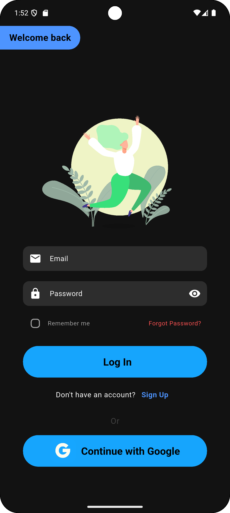
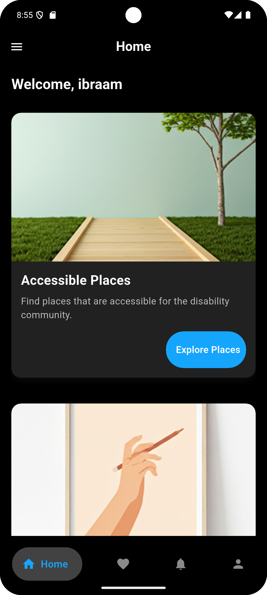
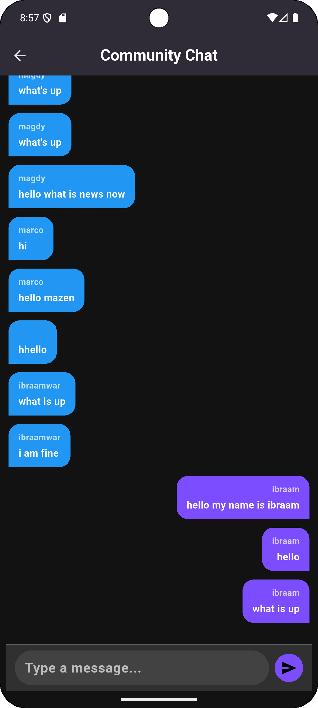
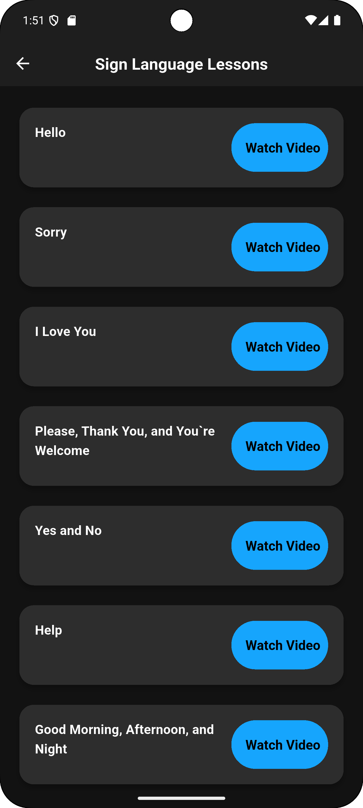
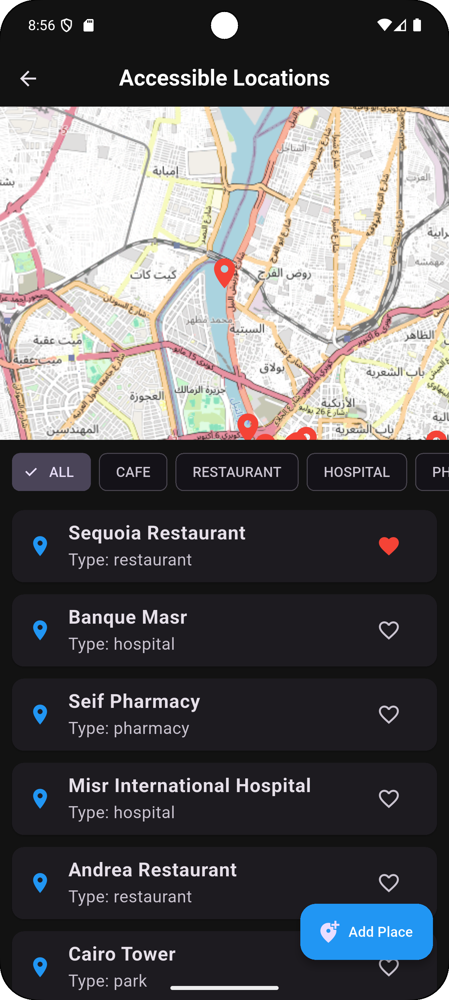
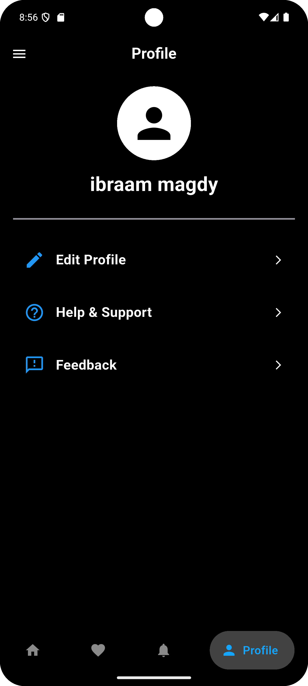

# Hand By Hand 🤝

<div align="center">


**Empowering the Disability Community Through Accessible Technology**

[](https://flutter.dev)
[](https://dart.dev)
[](https://firebase.google.com)
[](https://bloclibrary.dev)

</div>

## 📱 About The Project

**Hand By Hand** is a comprehensive mobile application designed to empower individuals within the disability community by providing accessible tools, resources, and educational content. Our mission is to foster independence, enhance communication, and promote inclusivity through technology.

### 🌟 Key Features

- **🎯 Accessible Places Locator** - Discover disability-friendly locations with detailed accessibility information
- **🤟 Sign Language Learning** - Interactive tutorials and lessons for mastering sign language
- **👥 Community Platform** - Connect with others through chat, posts, and social feeds
- **🌟 Role Models Gallery** - Get inspired by stories of people who have overcome challenges
- **🌙 Adaptive Interface** - Full support for light/dark mode and English/Arabic languages
- **🔔 Smart Notifications** - Stay updated with relevant community activities

## 🏗️ Project Architecture

```
lib/
├── core/
│   ├── config/          # Theme, routes, constants
│   ├── utils/           # Helpers, extensions, validators
│   └── usecases/        # use case class
|   |__ services/        # services
|   |__ widgets/         # common widgets
|   |__ errors/          # error handling
├── features/
│   ├── auth/            # Authentication flow
│   ├── home/            # Dashboard and main screen
│   ├── community/       # Chat, posts, messaging
│   ├── accessible_places/ # Location services
│   ├── sign_language/   # Learning modules
│   ├── role_model/      # Inspirational stories
│   └── notification/    # Push notifications
│   └── know_about_us/   # knolodge about my app and my career
│   └── onboarding/      # onboarding screen with good ui
```

## 🚀 Getting Started

### Prerequisites

- Flutter SDK 3.19 or higher
- Dart 3.3 or higher
- Android Studio/VSCode with Flutter extension
- Firebase project setup

### Installation

1. **Clone the repository**
   ```bash
   git clone https://github.com/ibraam123/hand_by_hand.git
   cd hand_by_hand
   ```

2. **Install dependencies**
   ```bash
   flutter pub get
   ```

3. **Setup Firebase**
   - Create a new Firebase project
   - Add Android and iOS apps to your project
   - Download `google-services.json` and `GoogleService-Info.plist`
   - Place them in the appropriate directories

4. **Configure localization**
   - Ensure `assets/translations/` directory exists with:
     - `en.json` (English translations)
     - `ar.json` (Arabic translations)

5. **Run the application**
   ```bash
   flutter run
   ```

## 🛠️ Tech Stack & Packages

### Core Framework
- **Flutter** - UI framework
- **Dart** - Programming language

### State Management
- **flutter_bloc** - BLoC pattern implementation
- **Equatable** - Value equality

### Backend & Storage
- **Firebase Auth** - Authentication
- **Cloud Firestore** - Database
- **Firebase Cloud Messaging** - Push notifications
- **Shared Preferences** - Local storage

### UI & UX
- **ScreenUtil** - Responsive design
- **Easy Localization** - Multi-language support
- **GoRouter** - Navigation routing

### Development Tools
- **get_it** - Dependency injection
- **intl** - Internationalization
- **image_picker** - Media handling

## 📁 Project Structure Details

### State Management (BLoC Pattern)
```
cubits/
├── theme_cubit/          # Theme and language management
├── auth_cubit/           # Authentication state
├── profile_cubit/        # User profile management
├── place_cubit/          # Accessible places data
├── posts_cubit/          # Community posts
├── message_cubit/        # Chat functionality
└── sign_language_cubit/  # Learning content
```

### Features Implementation
Each feature follows the clean architecture pattern:
- **data/** - Repositories, data sources
- **domain/** - Entities, use cases
- **presentation/** - UI, cubits, widgets

## 🎨 UI/UX Features

### Adaptive Design
- **Responsive Layout** - Works on various screen sizes
- **Dark/Light Theme** - User preference based
- **Accessibility** - Built with WCAG guidelines

### Internationalization
- **English & Arabic** - Full RTL support
- **Dynamic Language Switching** - No app restart required

### Navigation
- **GoRouter** - Declarative routing
- **Deep Linking** - Support for app links
- **Protected Routes** - Authentication guards

## 🔧 Configuration

### Environment Setup
1. **Flutter Environment**
   ```bash
   flutter doctor
   flutter pub get
   ```

2. **Firebase Configuration**
   - Enable Authentication (Email/Password)
   - Setup Firestore Database
   - Configure Cloud Messaging
   - Add SHA certificates for Android

3. **Localization Files**
   Structure your translation files in `assets/translations/`:
   ```json
   {
     "app_name": "Hand By Hand",
     "auth": {
       "email": "Email",
       "password": "Password"
     }
   }
   ```

## 📸 Screenshots

| Login Screen | Home Screen | Community Chat |
|--------------|-------------|----------------|
|  |  |  |

| Sign Language | Accessible Places | Profile |
|---------------|-------------------|---------|
|  |  |  |

## 🚀 Building for Production

### Android
```bash
flutter build apk --release
# or
flutter build appbundle --release
```

### iOS
```bash
flutter build ios --release
```

## 🤝 Contributing

We welcome contributions! Please see our [Contributing Guidelines](CONTRIBUTING.md) for details.

### Development Workflow
1. Fork the repository
2. Create a feature branch (`git checkout -b feature/amazing-feature`)
3. Commit your changes (`git commit -m 'Add amazing feature'`)
4. Push to the branch (`git push origin feature/amazing-feature`)
5. Open a Pull Request

## 📄 License

This project is licensed under the MIT License - see the [LICENSE.md](LICENSE.md) file for details.

## 👥 Team

- **Ibraam Magdy** - Lead Developer
- [Add your team members here]

## 🙏 Acknowledgments

- Flutter community for excellent documentation
- Firebase team for robust backend services
- All contributors and testers from the disability community

## 📞 Support

If you have any questions or need help with setup, please:
- Open an issue on GitHub
- Contact us at ibraam.software@gmail.com
- Check our [FAQ](docs/FAQ.md)

---

<div align="center">

**Made with ❤️ for the Disability Community**

*"Together, we rise. Together, we thrive."* 🌟

</div>


---

*This project is part of our commitment to creating inclusive technology that makes a real difference in people's lives.*
